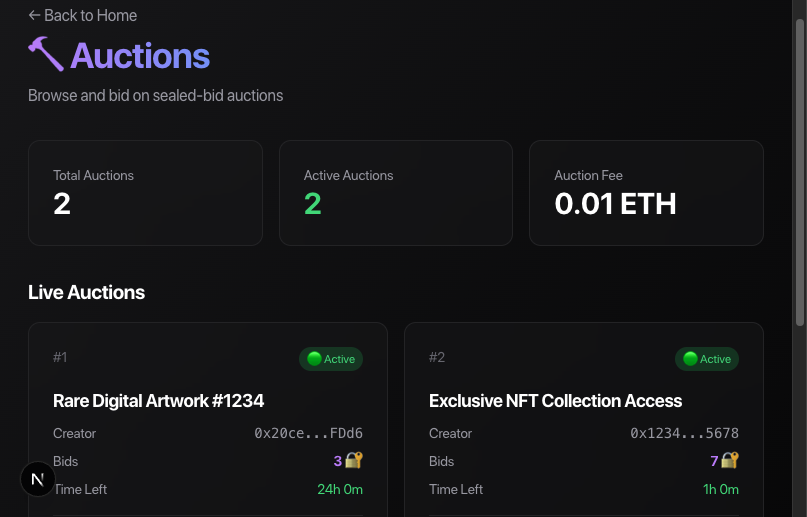
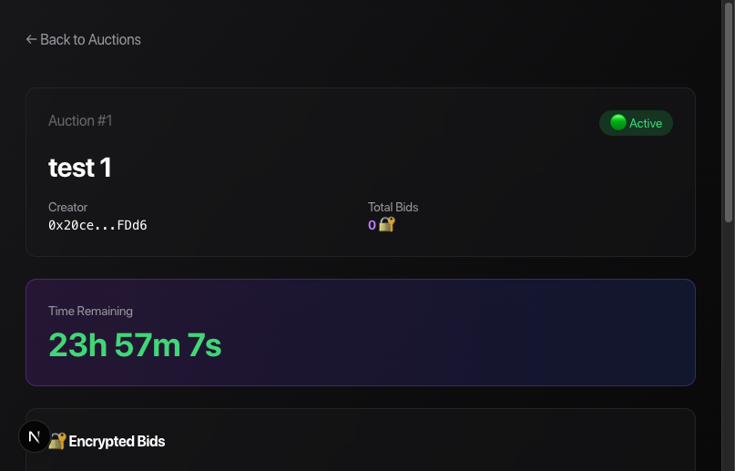

# 🦈 Sharki Auction - Private Auction System

**Sealed-bid auctions with encrypted bids using Zama's Fully Homomorphic Encryption (FHE)**

[](https://sharkiauction.vercel.app)

[](https://sepolia.etherscan.io/address/0xad54c0BD7aF07595Dd7a876aa5C1ED7Dd5Da4673)
[](https://docs.zama.ai/fhevm)
[](https://nextjs.org)

---

## 🌐 Live Demo

**🔗 https://sharkiauction.vercel.app**

---

## 🔗 Smart Contract

**Sepolia Testnet:** https://sepolia.etherscan.io/address/0xad54c0BD7aF07595Dd7a876aa5C1ED7Dd5Da4673

---

## 📸 Screenshots

### Auction Marketplace

*Browse all live auctions with encrypted bid counts and real-time countdown timers*

### Auction Details & Bidding

*Place encrypted bids - only the auction creator can decrypt when the auction ends*

---

## 🔐 How FHE Privacy Works

| Step | Description |
|------|-------------|
| **1** | Creator sets encrypted reserve price |
| **2** | Bidders place encrypted bids |
| **3** | Nobody can see bid amounts - not even other bidders |
| **4** | Winner revealed only when auction ends |

### Privacy Features:
- 🔒 **Encrypted Reserve Price** - Hidden from bidders
- 🔒 **Encrypted Bids** - Stored as `euint64` on-chain
- 🔒 **Permission-Based Decryption** - Only creator can reveal bids
- 🔒 **Fair Sealed-Bid** - No front-running possible

---

## 📋 Contract Details

| Property | Value |
|----------|-------|
| **Network** | Sepolia Testnet |
| **Contract Address** | `0xad54c0BD7aF07595Dd7a876aa5C1ED7Dd5Da4673` |
| **Auction Fee** | 0.001 ETH |
| **FHEVM Version** | 0.9 (ZamaEthereumConfig) |

---

## 🛠️ Tech Stack

| Layer | Technology |
|-------|------------|
| **Smart Contract** | Solidity 0.8.24 + FHEVM |
| **Frontend** | Next.js 15 + React + TypeScript |
| **Styling** | Tailwind CSS |
| **Wallet** | RainbowKit + wagmi |
| **Encryption** | Zama FHEVM (`euint64`, `FHE.asEuint64()`, `FHE.allow()`) |
| **Deployment** | Vercel |

---

## 📁 Project Structure

```
.
├── app/                          # Next.js frontend
│   ├── auction/                  # Auction pages
│   │   ├── page.tsx              # Auctions list
│   │   ├── create/page.tsx       # Create auction
│   │   └── [id]/page.tsx         # Auction details & bidding
│   ├── components/               # React components
│   └── page.tsx                  # Home page
├── private-auction/              # Contract & deployment
│   ├── contracts/
│   │   └── PrivateAuction.sol    # 🔐 Main FHEVM contract
│   └── scripts/
│       └── deploy.js             # Deployment script
├── lib/
│   └── auctionContract.ts        # Contract ABI & address
└── .env.local                    # Environment variables
```

---

## 🚀 Quick Start

### 1. Install Dependencies
```bash
npm install
```

### 2. Run Development Server
```bash
npm run dev
```

### 3. Deploy Contract (if needed)
```bash
cd private-auction
npm install
SEPOLIA_PRIVATE_KEY=your_key npx hardhat run scripts/deploy.js --network sepolia
```

---

## 🔐 FHEVM Features Used

```solidity
// Encrypted data types
euint64 reservePrice;
euint64 highestBid;
mapping(address => euint64) bids;

// On-chain encryption
euint64 bid = FHE.asEuint64(bidAmount);

// Permission-based decryption
FHE.allowThis(bid);
FHE.allow(bid, auctionCreator);
```

### Events on Etherscan:
```
Log: TrivialEncrypt
  pt: 1000000000          ← Input (bid amount)
  result: 0x9C219814ECC... ← Encrypted ciphertext

Log: Allowed  
  account: 0x20ce...FDd6  ← Who can decrypt
  handle: 0x9C219814ECC... ← The encrypted value
```

---

## ✅ Features Checklist

- [x] Smart contract with FHEVM encryption
- [x] Encrypted bid storage (`euint64`)
- [x] Permission-based access (`FHE.allow()`)
- [x] Deployed to Sepolia
- [x] Working frontend UI
- [x] Wallet integration (MetaMask, Coinbase, Phantom)
- [x] Live deployment on Vercel
- [x] Documentation

---

## 🔗 Links

| Resource | URL |
|----------|-----|
| **Live Demo** | https://sharkiauction.vercel.app |
| **Smart Contract** | https://sepolia.etherscan.io/address/0xad54c0BD7aF07595Dd7a876aa5C1ED7Dd5Da4673 |
| **GitHub** | https://github.com/adreyyan/sharkiauction |
| **Zama FHEVM Docs** | https://docs.zama.ai/fhevm |

---

## 👥 Team

Built with **Zama FHEVM** 🏆

---

## 📜 License

MIT
